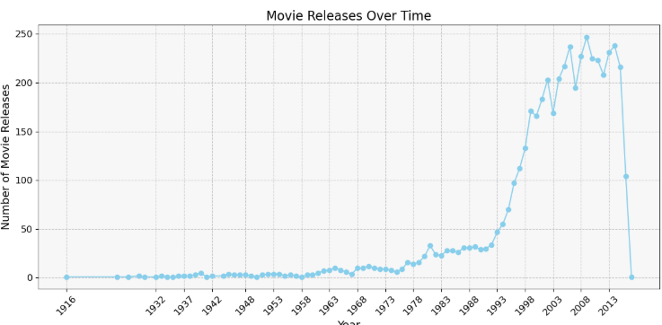
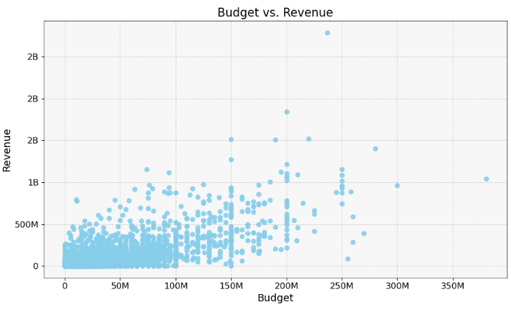
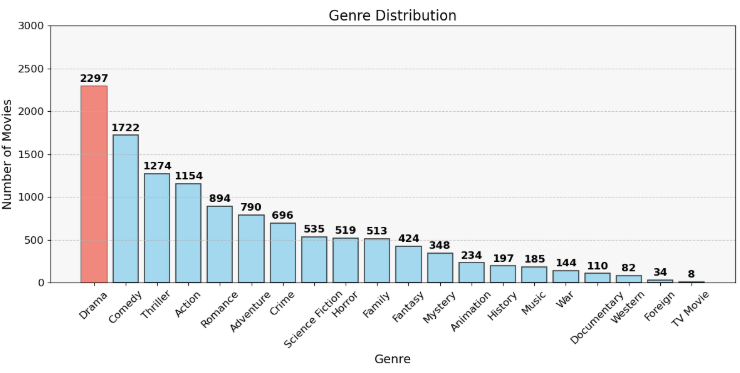
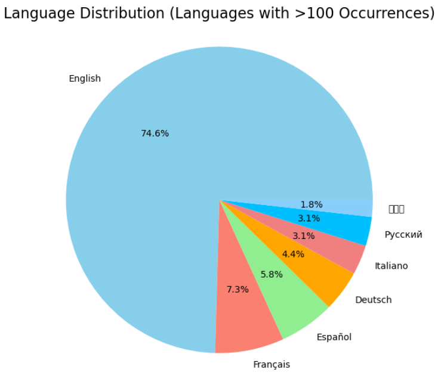
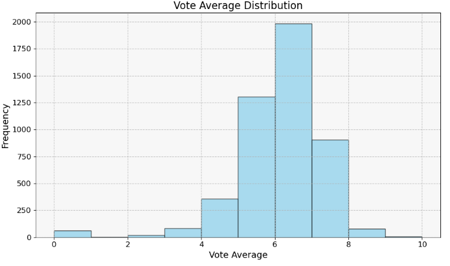
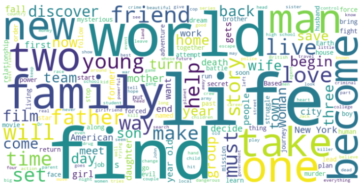
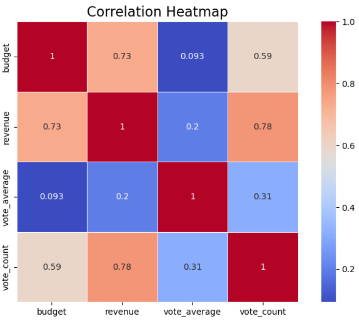

# Movie Data Analysis with Python (EDA)

This project dives deep into a comprehensive exploratory data analysis (EDA) of over 4,800 movies using two datasets (`movies.csv` and `credits.csv`). By merging, cleaning, and visualizing this data, the project uncovers trends in movie production, popularity, revenue, genres, languages, and more from 1997 to 2016.

---

## Dataset Overview

- **movies.csv** — includes metadata like budget, genres, homepage, keywords, language, and popularity.
- **credits.csv** — contains cast and crew information for each movie.

Merged on: `id` (from movies) and `movie_id` (from credits)

---

## Key Questions Explored

- Which year had the highest number of movie releases?
- What is the relationship between movie budgets and revenues?
- Which genres dominate the industry?
- What languages are most common in global cinema?
- What are the patterns in average movie ratings?

---

## Exploratory Data Visualizations

### Movie Releases Over Time
Visualizes the number of movies released each year from 1997 to 2016.  

---

### Budget vs Revenue Scatter Plot
Reveals how movie budgets correlate with generated revenues.  

---

### Genre Distribution
Shows the frequency of genres to determine dominant cinematic categories.  

---

### Language Distribution Pie Chart
Depicts the most common original languages of the films.  

---

### Vote Average Histogram
Illustrates how movies are rated on average, shedding light on sentiment.  

---

### Word Clouds

#### Tagline Word Cloud  
Common marketing phrases found in movie taglines.  

#### Overview Word Cloud  
Recurring narrative themes from movie descriptions.  

---

### Correlation Heatmap  
Explore relationships between numerical features like budget, revenue, votes, and ratings.  

---

## 🛠Tools & Libraries

- Python
- Pandas, NumPy
- Matplotlib, Seaborn
- JSON, WordCloud
- Jupyter Notebook

---

## Project Highlights

- Merged two complex datasets into a single rich dataframe.
- Cleaned nested JSON columns for genres, production companies, cast, and languages.
- Extracted insights using multiple visualization types.
- Enhanced plot styling for professional visual communication.

